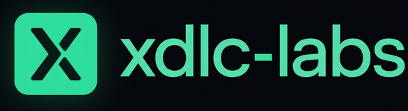

  

Use the coding agent you already run. Claude, Codex, Cursor, or Gemini.

**[xdlc-agent](https://github.com/xdlc-labs/xdlc-agent)** is a daemon next to your repos. When GitHub Actions fails, it can open a **Fix** with that agent. Promote and Revert stay off until you turn them on.

**[Airlock](https://github.com/xdlc-labs/airlock)** is a CI gate for AI artifacts: prompts, skills, MCP servers, and models. It snapshots what changed, checks policy, and ships, blocks, or asks for approval.

| Product | CLI | License |
|---------|-----|---------|
| [xdlc-agent](https://github.com/xdlc-labs/xdlc-agent) | `xdlc` | MIT |
| [Airlock](https://github.com/xdlc-labs/airlock) | `airlock` | Apache-2.0 |

**Site:** [xdlc.dev](https://xdlc.dev) · [xdlc-agent docs](https://xdlc.dev/agent/docs) · [Airlock docs](https://xdlc.dev/airlock/docs)

## Try it

| Repo | What you do |
|------|-------------|
| [example-service](https://github.com/xdlc-labs/example-service) | Point xdlc-agent at this small HTTP app (`/healthz`, `/metrics`) |
| [fixtures](https://github.com/xdlc-labs/fixtures) | Open a sample PR that fails CI, then watch a Fix |
